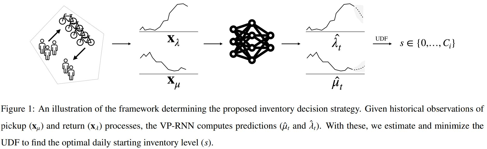

# Variational Poisson Recurrent Neural Network
Official implementation of [Predictive and Prescriptive Performance of Bike-Sharing Demand Forecasts for Inventory Management](https://arxiv.org/abs/2108.00858)

</td> <br/>

## Prerequisites

To install all required dependencies, run
```
pip install -r requirements.txt
```

## Contents

* `src/algos/vprnn.py`: PyTorch implementation of VP-RNN and MOVP-RNN modules (Section 3.2).
* `src/algos/inventory_decision.py`: implementation of queuing model for inventory management (Section 3.1).
* `src/misc/`: helper functions.
* `data/`: csv files for NYC experiments.
* `saved_files/`: directory for saving results, logging, etc.
* `run_vprnn.py`: script for running VP-RNN on NYC data.
* `run_movprnn.py`: script for running MOVP-RNN on NYC data.

## Examples

To run the VP-RNN pipeline, `run_vprnn.py` accepts the following arguments:
```bash
model arguments:
    --epochs        number of epochs to train (default: 50k)
    --no-cuda       disables CUDA training (default: False, i.e. run on CPU)
    --seed          random seed (default: 1)
    --patience      how many epochs without improvement to stop training
    --no-train      disables training process (default: False, i.e. train)
    --no-predict    disables prediction process (default: False, i.e. generate predictions)
    --no-decision   disables decision model (default: False, i.e. run queueing model)
    
data arguments:
    --stations       list of station IDs on which to run pipeline
    --interval       defines temporal aggregation (defaul: 60min)
```

### Training, generating demand predictions & inventory decisions

1. To train, compute demand predictions, and inventory decisions with an VPRNN model (using the default parameters) on e.g. station 426 and 229, run the following:
```
python run_vprnn.py --stations 426 229
```

During execution, this will store the following:
* Model parameter after training in `saved_files/{15,30,60}min/trained_models/rnn/`
* Prediction and Optimization performance in `saved_files/{15,30,60}min/results/`
* Predicted demand vectors in `saved_files/{15,30,60}min/predicted_demand/`
* Qualitative visualization of demand predictions in `saved_files/{15,30,60}min/images/`

2. TODO add any additional steps for decisions
```
python
```

## Credits
This work was conducted as a joint effort with [Yihua Wang*](https://www.professors.wi.tum.de/en/log/team/yihua-wang-msc/), [Dennis Prak*](https://people.utwente.nl/d.r.j.prak), [Filipe Rodrigues'](http://fprodrigues.com/), [Stefan Minner*](https://www.professors.wi.tum.de/log/team/minner/) and [Francisco C. Pereira'](http://camara.scripts.mit.edu/home/), at Technical University of Denmark' and Technical University of Munich*. 

## Reference
```
@inproceedings{GammelliEtAl2021,
  author = {Gammelli, D. and Wang, Y. and Prak, D. and Rodrigues, F. and Minner, S. and Pereira, F. C.},
  title = {Predictive and Prescriptive Performance of Bike-Sharing Demand Forecasts for Inventory Management},
  year = {2021},
  note = {Submitted},
}
```

----------
In case of any questions, bugs, suggestions or improvements, please feel free to contact me at daga@dtu.dk.

